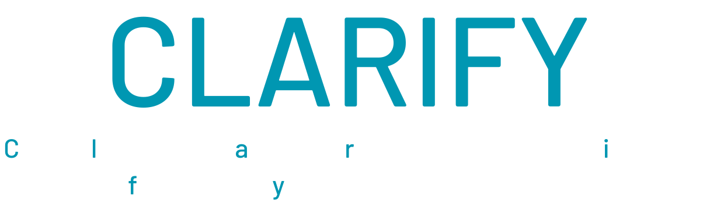
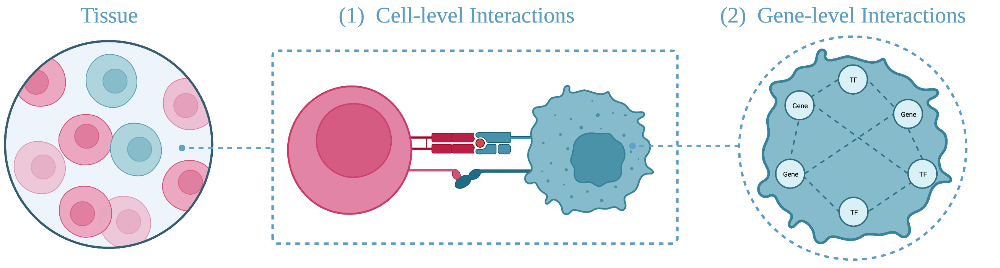

<!-- # $\definecolor{teal}{RGB}{48, 152, 176} \Huge\color{teal}{\textsf{Clarify}}$
$\large\textsf{Multi-level graph autoencoder (GAE) to clarify:}$

$\large\textsf{(1) {\color{teal}{c}}ell cel}\textsf{{\color{teal}{l}} interactions } \textsf{{\color{teal}{a}}nd} \textsf{ (2) gene {\color{teal}{r}}egulatory network } \textsf{{\color{teal}{i}}nference } \textsf{{\color{teal}{f}}rom } \textsf{spatiall{\color{teal}{y}} resolved transcriptomics.}$ -->
<p align="center">

<hr></hr>
</p>
<p align="center">

<hr></hr>
</p>

## Article
Check out our <em>ISMB'2023</em> and <em>Bioinformatics</em> paper [here](https://academic.oup.com/bioinformatics/article/39/Supplement_1/i484/7210503).

## Installation & Setup

Make sure to clone this repository along with the submodules as follows:

```
git clone --recurse-submodules https://github.com/MihirBafna/clarify.git
cd clarify
```
To install dependencies to a conda environment, follow the instructions provided in the [installation.md](./installation.md)

## Data
Three datasets were utilized for evaluation:

1. seqFISH profile of mouse visual cortex [(Zhu _et al_., 2018)](https://www.nature.com/articles/nbt.4260)
2. MERFISH profile of mouse hypothalamic preoptic region [(Moffitt _et al_., 2018)](https://www.science.org/doi/10.1126/science.aau5324)
3. scMultiSim simulated dataset [(Li _et al_., 2022)](https://www.biorxiv.org/content/10.1101/2022.10.15.512320v1)

All of the preprocessed data are organized into pandas dataframes and are located at [./data](./data). These dataframes can be used directly as input to Clarify.

## Demos & Results

To reproduce results, make sure you either run Clarify's preprocessing or copy the contents from [this dropbox link](https://www.dropbox.com/sh/sioss3ig3pwu0it/AACrcmeIDnPjF2jlJtGpLw_oa?dl=0). Download this directory and copy each "1_preprocessing_output" folder into the respective folders (["./out/seqfish"](./out/seqfish), ["./out/merfish"](./out/merfish), ["./out/scmultisim_final"](./out/scmultisim_final)) in your cloned repository. 

To visualize results (from pretrained Clarify models) and play around with demos, use the following interactive notebooks:
1. [preprocessing.ipynb](preprocessing.ipynb)
2. [evaluation.ipynb](evaluation.ipynb)

## Run Clarify

To run Clarify, run main.py and configure parameters based on their definitions below:

```
usage: main.py [-h] [-m MODE] [-i INPUTDIRPATH] [-o OUTPUTDIRPATH] [-s STUDYNAME] [-t SPLIT] 
               [-n NUMGENESPERCELL] [-k NEARESTNEIGHBORS] [-l LRDATABASE] [--fp FP] [--fn FN] [-a OWNADJACENCYPATH]
```
The first row of parameters are necessary

*  `-m MODE, --mode MODE`  clarify mode: preprocess,train (pick one or both separated by a comma)
*  `-i INPUTDIRPATH, --inputdirpath` Input directory path where ST dataframe is stored
*  `-o OUTPUTDIRPATH, --outputdirpath` Output directory path where results will be stored
*  `-s STUDYNAME, --studyname` clarify study name to act as identifier for outputs
*  `-t SPLIT, --split` ratio of test edges [0,1)

This second row of parameters have defaults set and are not needed.

*  `-n NUMGENESPERCELL, --numgenespercell` Number of genes in each gene regulatory network (default 45)
*  `-k NEARESTNEIGHBORS, --nearestneighbors` Number of nearest neighbors for each cell (default 5)
*  `-l LRDATABASE, --lrdatabase` 0/1/2 for which Ligand-Receptor Database to use (default 0 corresponds to mouse DB)
*  `--fp FP`               (experimentation only) add # of fake edges to train set [0,1)
*  `--fn FN`               (experimentation only) remove # of real edges from train set [0,1)
*  `-a OWNADJACENCYPATH, --ownadjacencypath` Using your own cell level adjacency (give path)

For example, if you wanted to run Clarify (both preprocessing and training) on the seqFISH data input with a 70/30 train-test split, then use the following command and set the output folder and studyname accordingly:
```
python main.py -m preprocess,train -i ../data/seqFISH/seqfish_dataframe.csv -o [OUTPUT FOLDER PATH] -s [STUDYNAME] -t 0.3 
```
Since we have already preprocessed these datasets (link provided above), you can also skip that step by running the following command. Note that you should use the specified out folder (not your own) as that is where the preprocessed results are stored. You can still set your desired studyname.
```
python main.py -m train -i ../data/seqFISH/seqfish_dataframe.csv -o ../out/seqfish/ -s [STUDYNAME] -t 0.3 
```

## Cite
```
@Article{pmid37387180,
   Author="Bafna, M.  and Li, H.  and Zhang, X. ",
   Title="{{C}{L}{A}{R}{I}{F}{Y}: cell-cell interaction and gene regulatory network refinement from spatially resolved transcriptomics}",
   Journal="Bioinformatics",
   Year="2023",
   Volume="39",
   Number="Supplement_1",
   Pages="i484-i493",
   Month="Jun"
}
```
